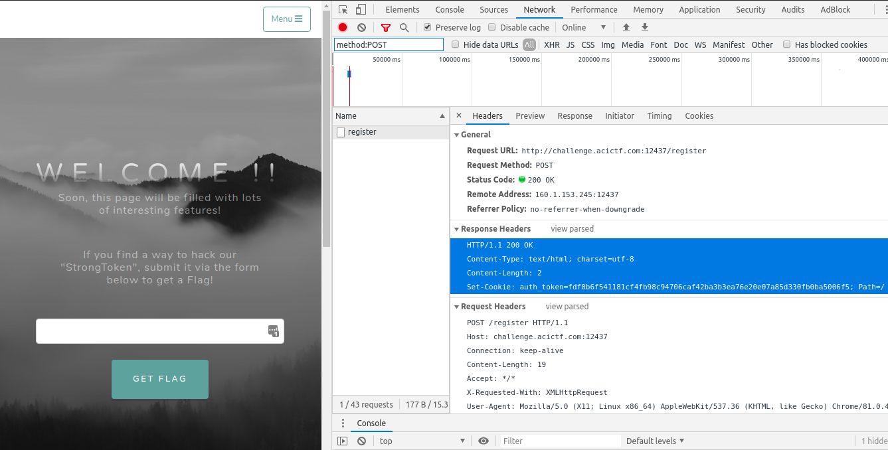

# Speak Plainly

## Cryptography -- 150 points

### Description

There's something suspicious about how account logins happen on this server... ? http://challenge.acictf.com:12437

### Hints

* Your username and the secret strongtoken are the only components of the encrypted cookie
* How does the length of your username effect the length of the cookie?
* It is possible to guess strongtoken one byte-at-a-time because of how AES-ECB works
* The strongtoken itself does not contain any ';' characters

### Solution
On the profile page:
> If you find a way to hack our "StrongToken", submit it via the form below to get a Flag!

Finally, the hint reveals:
> Your username and the secret strongtoken are the only components of the encrypted cookie

Thus, the goal is to first grab the encrypted cookie, find the "strong token" and then submit it to get the flag.

#### Get the Cookie
To get the cookie, navigate to the homepage and open Chrome dev tools. Click the **Network** tab, check the **Preserve log** option, and create a new account. The username and password fields can be completely blank and a new account will still be created. In the **Filter** text field, enter `method:POST` to search for the HTTP post request that created the account.



There is only be one post request, which is from the `/register` page and it has a cookie called `auth_token`. This information can be used to in a python script to further examine the token. The following python function will send a POST request to the `/register` page, submit a username and password, and retrieve the `auth_token` cookie. 

```
#!/usr/bin/python3
import requests


# Get the auth token (a cookie) from the challenge website
def get_auth_token(username):
    data = {
        "username": username,
        "password": "password"
    }
    # Request session
    url = "http://challenge.acictf.com:12437/"
    s = requests.Session()
    s.post(url + "register", data = data)
    auth_token = s.cookies['auth_token']
    s.close()
    return get_cipher_blocks(auth_token)
```

#### Get the Strong Token
[AES Electronic Codebook (ECB)][1] uses a 16 byte block cipher. The input length for AES ECB needs to be a multiple of 16 bytes, otherwise padding is added. The `get_auth_token` function breaks up the `auth_token` into 16 byte blocks (32 hex characters) to easily see the block separation.

On the website's index page, it states: 
> STRONGTOKEN HARDENED: We append a secret token before encrypting. Even if our AES keys are stolen, hackers cannot forge credentials!

Again, the hint reveals that only the username and token are part of the encrypted cookie:
> your username and the secret strongtoken are the only components of the encrypted cookie

Playing around with the input confirms this. Sending different passwords does not change the returned `auth_token` value. However, sending different usernames does.

Experimenting further, sending a username with 15 characters returns a cookie with 32 bytes (64 hex characters). And sending a username with 16 characters returns a cookie with 48 bytes (96 hex characters). That means that the 16th character causes the cipher to spill over to a new block, which means that a 15 character username plus auth token fits into a 32 byte cipher.

Take the following hypothetical example:
```
            0123456789ABCDEF  (this just helps count the characters)
  username: AAAAAAAAAAAAAAA   (15 bytes)
auth_token: BCDEFGHIJKLMNOPQR (17 bytes)
```
These sample inputs combine to create the plaintext:
```
            0123456789ABCDEF 0123456789ABCDEF (counter helper)            
plaintext1: AAAAAAAAAAAAAAAB CDEFGHIJKLMNOPQR (username + auth_token)
```

This plaintext encrypts to:
```
cipher1: 479ee841e07e0bc545ea4d54ccc35f09 (cipher text block 0)
         bce429f842aae6fed359f574311f542c
```

If the username is then changed to `AAAAAAAAAAAAAAAB` (16 bytes) then the username plus auth token combine to:
```
            0123456789ABCDEF 0123456789ABCDEF (counter helper)
plaintext2: AAAAAAAAAAAAAAAB BCDEFGHIJKLMNOPQ 
```
And this encrypts to:
```
cipher2: 479ee841e07e0bc545ea4d54ccc35f09 (cipher text block 0)
         6597fd2b7378edd3f7ce7e9a90acff56 
```

Notice that the first 16 bytes in plaintext1 and plaintext2 are both equal to "AAAAAAAAAAAAAAAB".
As a result, both block0's of ciphertext1 and ciphertext2 are identical.

Plugin the found secret token into the website and get the flag.

### References
* [Speak Plainly by John Hammond](https://youtu.be/f-iz_ZAS258)
* [Speak Plainly by welchbj](https://github.com/welchbj/ctf/tree/master/writeups/2020/CyberStakes/speak-plainly)
* [Block Cipher Mode (Wikipedia)][1]
* [Chosen Plaintext attack on AES in ECB mode][2]

[1]: https://en.wikipedia.org/wiki/Block_cipher_mode_of_operation#Electronic_codebook_(ECB)
[2]: https://crypto.stackexchange.com/questions/42891/chosen-plaintext-attack-on-aes-in-ecb-mode