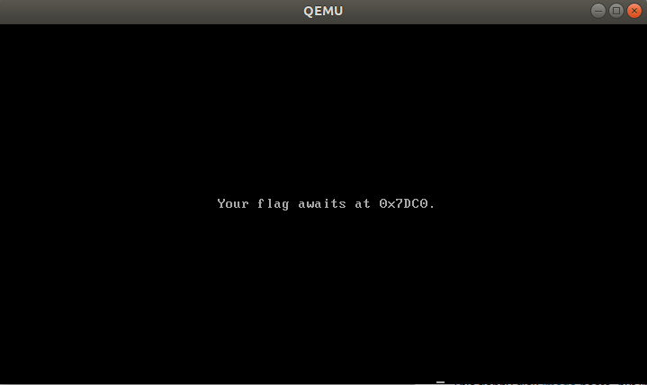

# Boot Riddle

## Forensics: 100 points

## Solve

This floppy disk [image](./files.tar.gz) boots, but instead of a flag we see some silly riddle...

## Hints

* If only we could inspect the device's memory while it is running...
* QEMU's [monitor][1] or Bochs' [debugger](http://bochs.sourceforge.net/doc/docbook/user/internal-debugger.html) might be useful to read up on.

## Solution

Untar the image file. Boot it up with Qemu with the `-monitor stdio` option that the hint mentions:
```
$ tar -xvf files.tar.gz 
floppy.img
$ qemu-system-i386 floppy.img -monitor stdio
```

The floppy boots up with this:



```
Your flag awaits at 0x7DC0
```

The monitor option provides an interactive prompt: `(qemu)`. Look at the `xp` command in the [QEMU/Monitor][1] link:

> xp /format address  
Displays memory at the specified physical address using the specified format.

The command `xp /30c 0x7dc0` does the following:
```
xp /format address
xp     - Displays memory at the specified physical address using the specified format.
/30c   - Will display 30 characters. 'c' stands for char
0x7dc0 - Start at this address
```

Run command `xp /30c 0x7dc0`:
```
(qemu) xp /30c 0x7dc0
0000000000007dc0: 'A' 'C' 'I' '{' 'R' 'E' 'A' 'L' 'm' 'o' 'd' 'e' '}' '\x00' '\x00' '\x00'
0000000000007dd0: '\x00' '\x00' '\x00' '\x00' '\x00' '\x00' '\x00' '\x00' '\x00' '\x00' '\x00' '\x00' '\x00' '\x00' '\x00' '\x00'
0000000000007de0: '\x00' '\x00' '\x00' '\x00' '\x00' '\x00' '\x00' '\x00' '\x00' '\x00' '\x00' '\x00' '\x00' '\x00' '\x00' '\x00'
0000000000007df0: '\x00' '\x00' '\x00' '\x00' '\x00' '\x00' '\x00' '\x00' '\x00' '\x00' '\x00' '\x00' '\x00' '\x00' 'U' '\xaa'
0000000000007e00: '\x00' '\x00' '\x00' '\x00' '\x00' '\x00' '\x00' '\x00' '\x00' '\x00' '\x00' '\x00' '\x00' '\x00' '\x00' '\x00'
0000000000007e10: '\x00' '\x00' '\x00' '\x00' '\x00' '\x00' '\x00' '\x00' '\x00' '\x00' '\x00' '\x00' '\x00' '\x00' '\x00' '\x00'
0000000000007e20: '\x00' '\x00' '\x00' '\x00' '\x00' '\x00' '\x00' '\x00' '\x00' '\x00' '\x00' '\x00' '\x00' '\x00' '\x00' '\x00'
0000000000007e30: '\x00' '\x00' '\x00' '\x00' '\x00' '\x00' '\x00' '\x00'
(qemu) 
```

The flag is revealed:
```
ACI{REALmode}
```

[1]:https://en.wikibooks.org/wiki/QEMU/Monitor