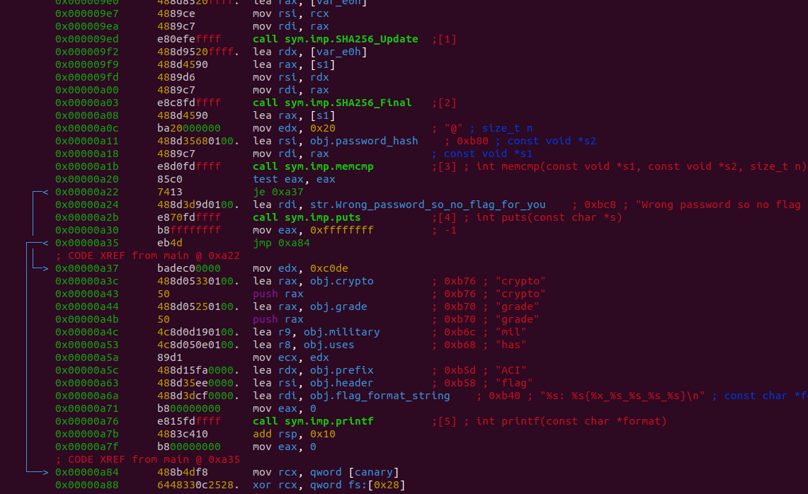

# Lockbox


## Reverse Engineering: 50 points

## Description

We developed this password-protected [program](./lockbox) which uses a super-secure, military-grade hash function with 256-bits of security to ensure only someone with the proper password can print the flag.

## Hints
* You do not need to crack the password.
* Tools like [ghidra](https://ghidra-sre.org/) are helpful when `strings` isn't enough.
* Looking at calls to `printf` and `puts` is probably a good place to start.

## Solution
Download the lockbox binary file. Check its file type:
```
$ file lockbox
lockbox: ELF 64-bit LSB shared object, x86-64, version 1 (SYSV), dynamically linked, interpreter /lib64/l, for GNU/Linux 3.2.0, BuildID[sha1]=1b089e3c03c5c7a5d44b608bb4b7e9dc73d9ad21, not stripped
```

Add execute permissions:
```
$ chmod +x lockbox
$ ls -la
-rwxrwxr-x 1 zionperez zionperez 9024 May  2 11:27 lockbox
```

Run it:
```
$ ./lockbox  
Enter the password to get the flag: password
Wrong password so no flag for you!
```

Open up lockbox in Radare2 with write permissions:
```
$ r2 -w lockbox
[0x00000830]> aaa
[x] Analyze all flags starting with sym. and entry0 (aa)
[x] Analyze function calls (aac)
[x] Analyze len bytes of instructions for references (aar)
[x] Check for objc references
[x] Check for vtables
[x] Type matching analysis for all functions (aaft)
[x] Propagate noreturn information
[x] Use -AA or aaaa to perform additional experimental analysis.
```

Analyze function list (afl):
```
[0x00000830]> afl
0x00000830    1 42           entry0
0x00000860    4 50   -> 40   sym.deregister_tm_clones
0x000008a0    4 66   -> 57   sym.register_tm_clones
0x000008f0    5 58   -> 51   sym.__do_global_dtors_aux
0x00000930    1 10           entry.init0
0x00000b10    1 2            sym.__libc_csu_fini
0x00000b14    1 9            sym._fini
0x00000aa0    4 101          sym.__libc_csu_init
0x0000093a    8 352          main
0x00000768    3 23           sym._init
0x00000790    1 6            sym.imp.printf
0x000007a0    1 6            sym.imp.puts
0x00000000    3 97   -> 123  loc.imp.__gmon_start
0x000007b0    1 6            sym.imp.fgets
0x000007c0    1 6            sym.imp.strlen
0x000007d0    1 6            sym.imp.SHA256_Final
0x000007e0    1 6            sym.imp.__stack_chk_fail
0x000007f0    1 6            sym.imp.memcmp
0x00000800    1 6            sym.imp.SHA256_Update
0x00000810    1 6            sym.imp.SHA256_Init
```

Go to the **main** function
```
[0x00000830]> s main
```

Enter visual mode.
```
> V
```

Press **p** a few times to go to assembly mode. Press **c** to view the cursor.



Look at address `0xA22`. The assembly instruction `je 0xa37` checks if the password and the hash are equal. The code `je 0xa37` will jump to `0xa37` if the passwords match. Change this to jump if the passwords do not match.

Move the cursor over address `0xA22` (`je 0xa37` line). Type colon `:` then enter command `wa jne 0xa37`. The command `wa` stands for "write assembly" and `jne` stands for "jump if not equal."
```
:> wa jne 0xa37
Written 2 byte(s) (jne 0xa37) = wx 7513
```

Exit radare. Run the lockbox program again:
```
$ ./lockbox 
Enter the password to get the flag: password
flag: ACI{c0de_has_mil_grade_crypto}
```


